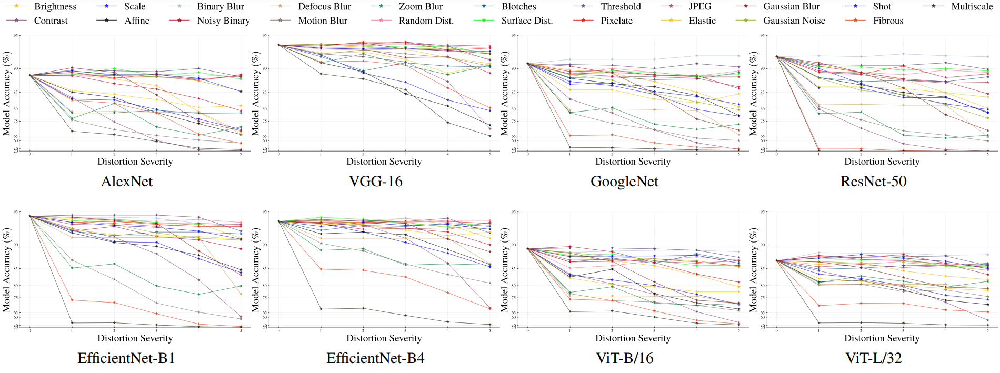

# Are Deep Models Robust against Real Distortions? A Case Study on Document Image Classification
This repository contains the datasets and code for the paper [Are Deep Models Robust against Real Distortions? A Case Study on Document Image Classification](https://www.preprints.org/manuscript/202202.0058/v1) by Saifullah, Shoaib Ahmed Siddiqui, Stefan Agne, Andreas Dengel, and Sheraz Ahmed.

Requires Python 3+. For evaluation, please download the data from the links below.

## Example Distortions:


## Mean Corruption Error (mCE) and Relative mCE values:


# RVL-CDIP-D:
[Download RVL-CDIP-D here.](http://projects.dfki.uni-kl.de/docrobustness/datasets/RVL-CDIP-D.zip)

RVL-CDIP-D has 16 classes with images of size 1000xW just like the original RVL-CDIP dataset. Each sample image has 21 different augmentations of 5 severity levels.


This spreadsheet shows the calculation of the
[mean corruption error (mCE) for RVL-CDIP-D dataset](https://docs.google.com/spreadsheets/d/1l8dK7BXAnYSmtqOzIVDxokHWLa3dNi3xkEsZ9YRzO4o/edit?usp=sharing).

# Tobacco3482-D:
[Download Tobacco3482-D here.](http://projects.dfki.uni-kl.de/docrobustness/datasets/Tobacco3482-D.zip)

Tobacco3482-D has 10 classes with images of size 1000xW. Each sample image has 21 different augmentations of 5 severity levels.



This spreadsheet shows the calculation of the
[mean corruption error (mCE) for Tobacco3482-D dataset](https://docs.google.com/spreadsheets/d/1-PkVeWTgv7I6aGpSqlEM-c9qdYWvpXgd1WiIO5r3_Go/edit?usp=sharing).

# Generating the datasets from scratch
Install the project dependencies.
```
pip install -r requirements.txt
```

## RVL-CDIP-D:
Set the DATASET_DIR to the root path of original RVL-CDIP dataset. 
```
export DATASET_DIR=</path/to/RVL-CDIP>
```
Set the DATASET_OUTPUT_DIR to the output path where the distorted dataset RVL-CDIP-D will be generated.
```
export DATASET_OUTPUT_DIR=</path/to/RVL-CDIP-D>
```
Run the augmentation script with the RVL-CDIP config.
```
 ./scripts/augment.sh --cfg ./cfg/rvlcdip-aug.yaml
```
## Tobacco3482-D:
Set the DATASET_DIR to the root path of original Tobacco3482 dataset. 
```
export DATASET_DIR=</path/to/Tobacco3482>
```

Set the DATASET_OUTPUT_DIR to the output path where the distorted dataset Tobacco3482-D will be generated. 
```
export DATASET_OUTPUT_DIR=</path/to/Tobacco3482-D>
```

Run the augmentation script with the Tobacco3482 config.
```
 ./scripts/augment.sh --cfg ./cfg/tobacco-aug.yaml
```

# Citation
If you find this useful in your research, please consider citing:
```
@INPROCEEDINGS{9956167,
  author={Saifullah and Siddiqui, Shoaib Ahmed and Agne, Stefan and Dengel, Andreas and Ahmed, Sheraz},
  booktitle={2022 26th International Conference on Pattern Recognition (ICPR)}, 
  title={Are Deep Models Robust against Real Distortions? A Case Study on Document Image Classification}, 
  year={2022},
  volume={},
  number={},
  pages={1628-1635},
  doi={10.1109/ICPR56361.2022.9956167}}
```

# License
This repository is released under the Apache 2.0 license as found in the LICENSE file.
